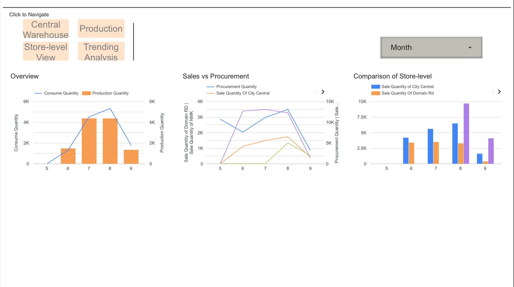

# 📦 Supply Chain Analyst – Smart Restaurant Dashboard

**Role:** Supply Chain Analyst  
**Period:** 2024 – 2025  
**Tools:** Google Looker Studio, Excel, SQL  

---

## 🌐 Project Overview

As a Supply Chain Analyst, I built a **multi-page interactive dashboard** to optimize inventory and procurement for a restaurant chain transitioning to a **centralized virtual warehouse** model.  
The dashboard unified data from **central warehouse, production, and three stores**, providing **real-time visibility** into consumption and supply planning.  

---

## 📑 Dashboard Pages

### 📍 Page 1 – Inventory Tracking & Procurement Advice
- Monitors **current stock levels** across product categories  
- Highlights **items below safety stock line** in red  
- Provides **automated purchase recommendations**  
- KPI cards for **current stock, turnover ratio, and shortage alerts**  

---

### 📍 Page 2 – Overseas Procurement Suggestions
- Dedicated analysis for **imported products via sea freight**  
- Calculates **optimal ordering quantities** considering long lead times  
- Forecasts demand to **avoid shortages and overstocking**  
- Helps balance **local vs overseas procurement cycles**  

---

### 📍 Page 3 – Store Consumption: City Central
- Tracks **daily, weekly, and monthly consumption** for each product group  
- Identifies demand trends specific to **City Central store**  
- Supports store managers with **accurate replenishment cycles**  

---

### 📍 Page 4 – Store Consumption: Dominion Road
- Provides **store-level consumption breakdown** for Dominion Road  
- Compares consumption trends against **central warehouse supply**  
- Helps detect **seasonal demand shifts**  

---

### 📍 Page 5 – Store Consumption: New Market
- Focused analysis for **New Market store**  
- Visualizes consumption patterns by product category  
- Enables **tailored procurement plans** for this location  

---

### 📍 Page 6 – Monthly Production & Consumption
- Summarizes **monthly production outputs** and **raw material usage**  
- Shows alignment between **production assembly** and **store demand**  
- Highlights gaps where **supply ≠ demand**  

---

### 📍 Page 7 – Trend Analysis
- Long-term analysis of **inventory turnover and consumption growth**  
- Detects patterns in **seasonal demand** and **procurement cycles**  
- Supports management in **strategic planning and supplier negotiations**  

---

## 🎯 Key Achievements
- Developed a **reusable dashboard template** covering **2 stores + 1 central warehouse**  
- Reduced manual reporting time by **70%** through automated dashboards  
- Improved **inventory turnover** and reduced shortage incidents  
- Enabled **data-driven procurement decisions** at both store and central levels  

---

✨ This dashboard provided a **poster-style, all-in-one view** of the supply chain — helping management and store teams collaborate effectively and optimize procurement.
