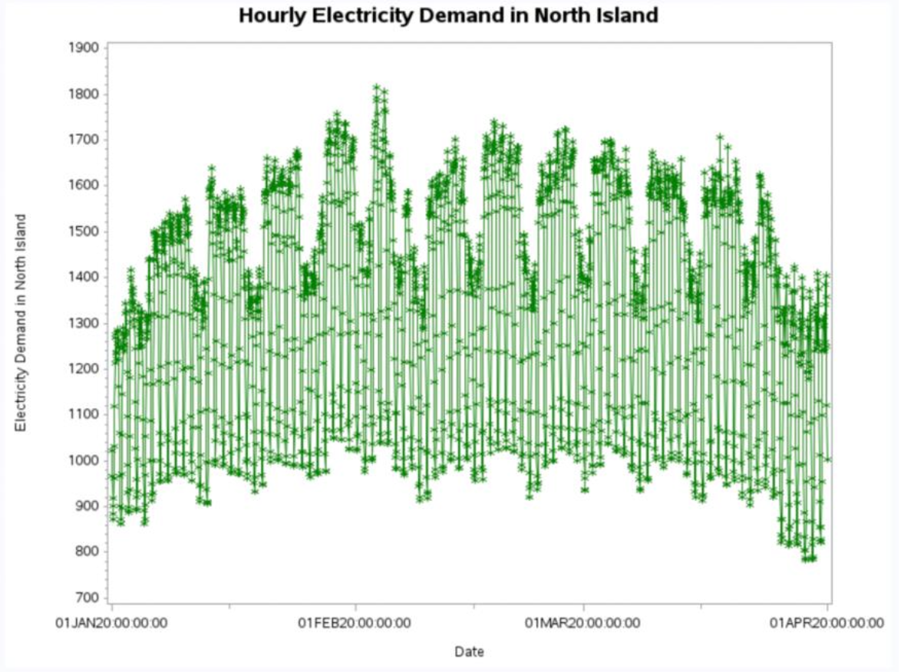
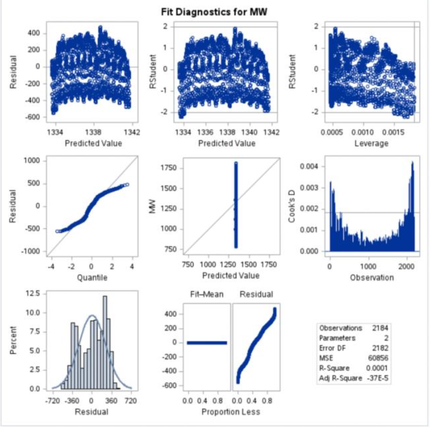
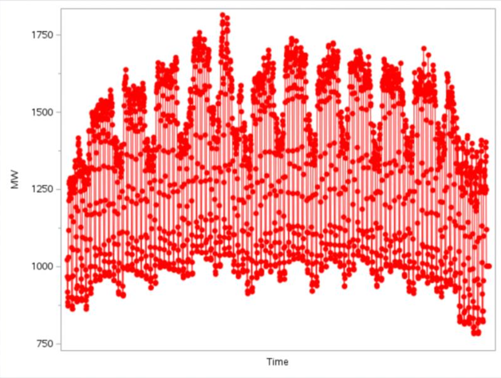
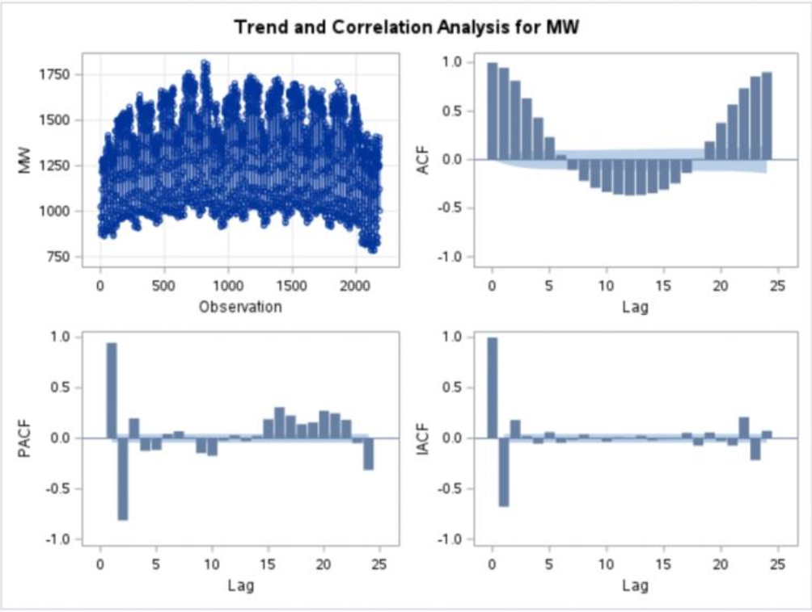
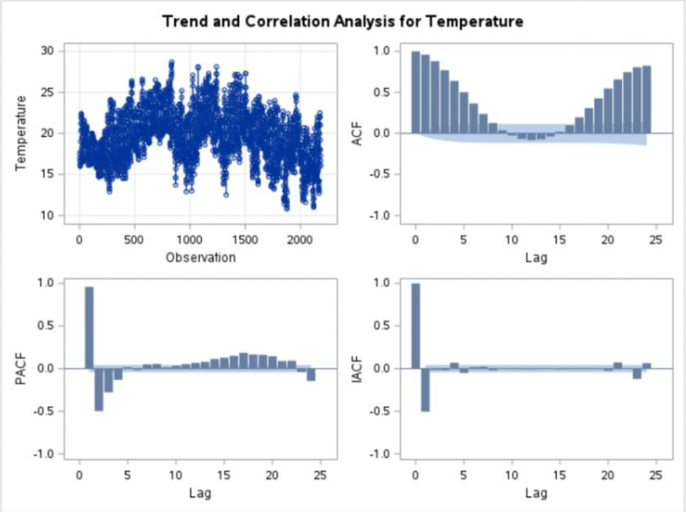
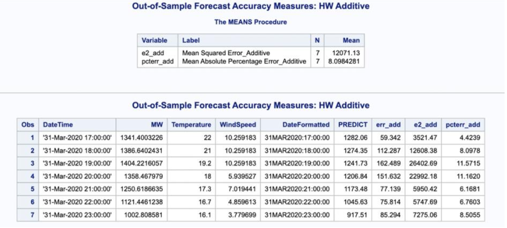

# ⚡ Electricity Demand Forecasting in New Zealand (North Island, 2020)

## Overview
This project analyzes **hourly electricity demand** data from the North Island of New Zealand (Jan–Mar 2020).  
The goal was to evaluate different **time series forecasting models** — including **regression, exponential smoothing, ARIMA, and ARIMAX** — and assess their predictive accuracy.

---

## Data Organization
- **Dataset**: Hourly electricity demand (MW), 1 Jan 2020 – 31 Mar 2020.  
- **Main Features**:  
  - Stable demand (1000–1800 MW) without long-term trend.  
  - Clear **daily diurnal cycles** and **weekly seasonal patterns**.  
  - Occasional spikes/drops linked to weather events or holidays.  

  
*Figure 1. Hourly demand shows strong daily and weekly seasonality.*

---

## Time Series Regression
- Model performance was weak:  
  - R² = 0.0001 → poor explanatory power.  
  - MSE = 246.7 → high error.  
  - DW = 0.104 → strong positive autocorrelation in residuals.  
- Conclusion: Regression did **not capture autocorrelation or seasonality**.  

  
*Figure 2. Regression residuals highlight strong autocorrelation.*

---

## Exponential Smoothing (ESM)
- Estimated **level parameter = 0.999** (very dependent on previous observation).  
- Parameters statistically significant (p < 0.001).  
- Limitation: Cannot capture seasonal/complex demand patterns.  

  
*Figure 3. ESM produces forecasts but misses seasonal dynamics.*

---

## ARIMA Models
- Explored differencing stages and candidate models:  
  - **ARIMA(1,1,0)** and **ARIMA(1,1,1)**  
- Forecast results:  
  - Captured short-term trends.  
  - Confidence intervals widened rapidly, reducing long-term accuracy.  

  
*Figure 4. ARIMA forecasts with wide confidence intervals.*

---

## ARIMAX Models
- Incorporated **exogenous variables**: Temperature & Wind Speed.  
- Findings:  
  - Improved short-term performance compared to ARIMA.  
  - Forecast uncertainty still grew over time.  

  
*Figure 5. ARIMAX with exogenous variables improves short-term accuracy.*

---

## Out-of-Sample Forecasting
- Held out **last 7 days** as test set.  
- Compared **Holt-Winters Additive** vs **ARIMA(0,1,0)(1,0,0)**.  

| Model                  | MSE     | MAPE   |
|-------------------------|---------|--------|
| Holt-Winters Additive   | 18,717  | 11.00% |
| ARIMA(0,1,0)(1,0,0)     | 36,865  | 16.39% |

✅ **Holt-Winters additive outperformed ARIMA** for this dataset.

  
*Figure 6. Holt-Winters additive model produced more accurate forecasts.*

---

## Conclusion
- **Regression**: Too simple, poor fit.  
- **ESM**: Limited predictive power for seasonal data.  
- **ARIMA/ARIMAX**: Good for short-term, but uncertainty grows.  
- **Holt-Winters Additive**: Best performance in accuracy and stability.  

📌 **Insight**: Seasonal models (like Holt-Winters) are better suited for electricity demand forecasting where **daily & weekly cycles dominate**.
