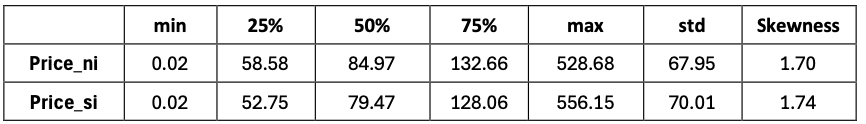
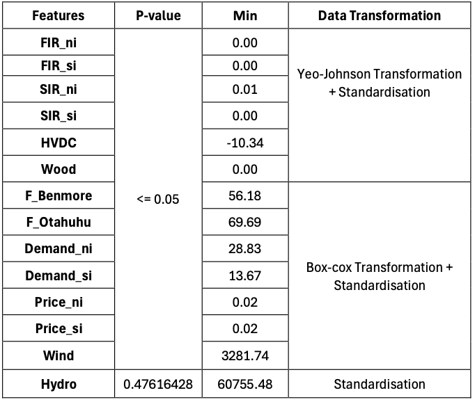
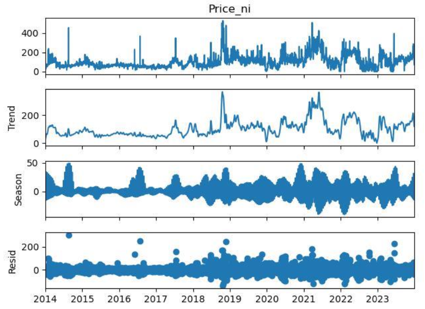
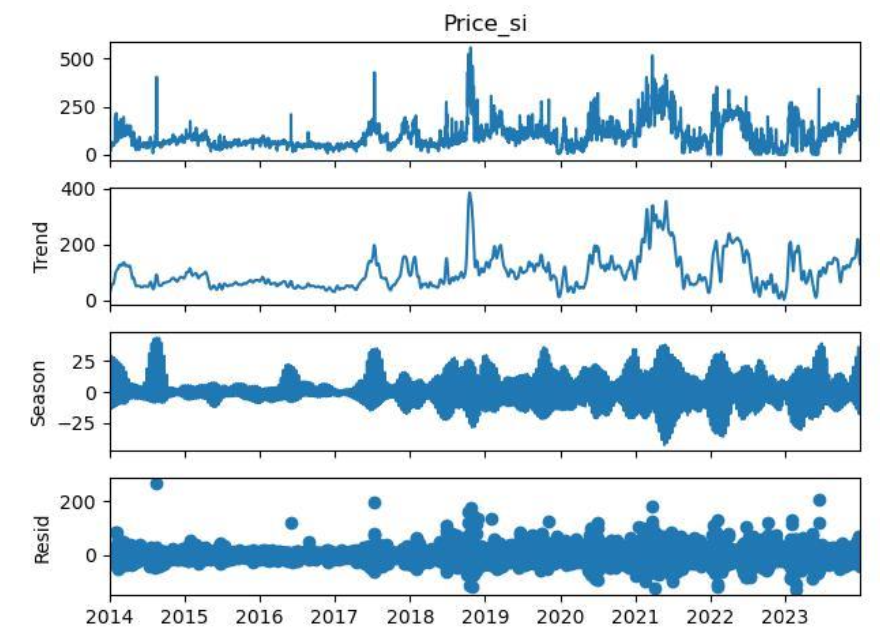
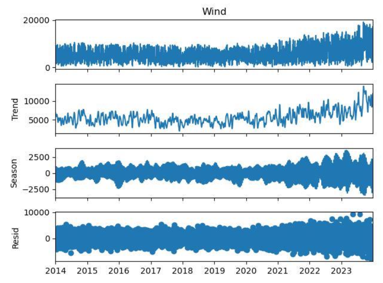
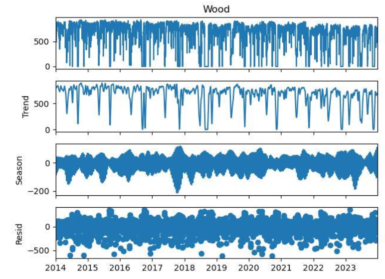
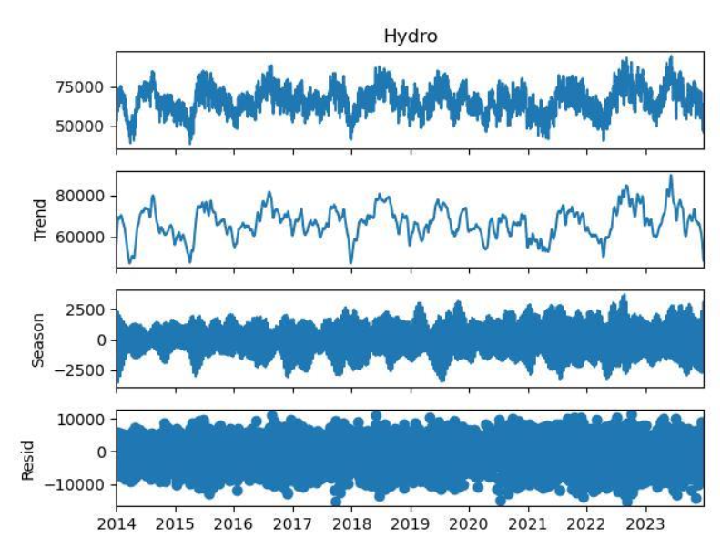
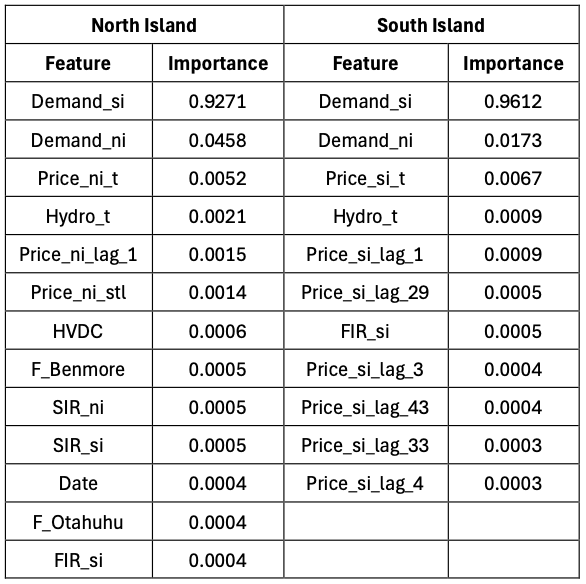
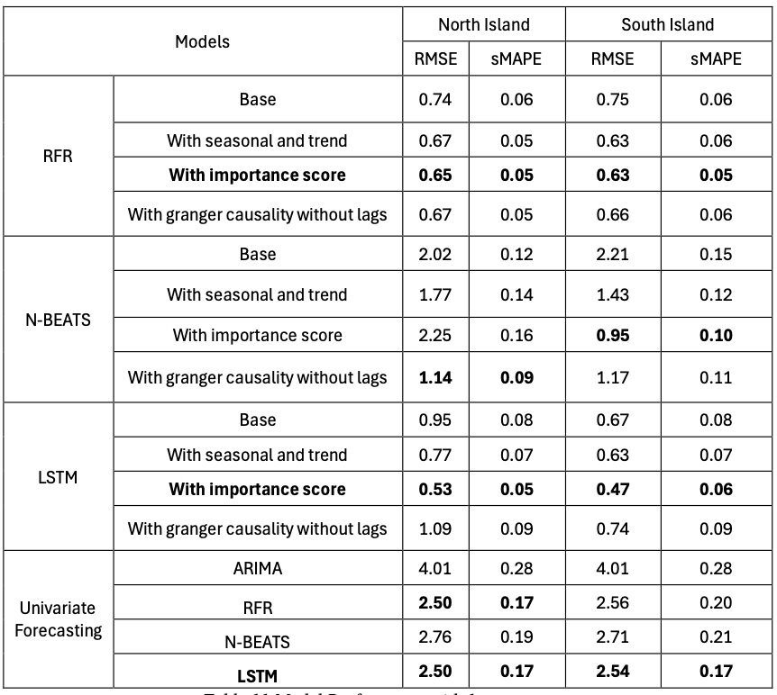

# Forecasting New Zealand Electricity Prices

_A comparative study of forecast models and the impact of renewable energy_  
**Author:** Yuxin Lang  
**Supervisor:** Shu Su / Nuttanan Wichitaksorn  
**Date:** 27/10/2024  

---

## 📌 Abstract

This study explores the relationship between renewable energy generation and electricity prices in New Zealand and evaluates the accuracy of various models in predicting electricity prices. We focused on hydro, wind, and wood energy, assessing their impact on electricity prices in the North and South Islands.  

- Feature selection was performed using **Random Forest importance scores** and **Granger causality tests**.  
- Forecasting models included **Random Forest Regressor (RFR)**, **N-BEATS**, **LSTM**, and **ARIMA**.  
- Results show that **LSTM with feature importance** performs best in short-term forecasts.  
- Hydropower plays a key role in seasonal and trend fluctuations in electricity prices.  

---

## 🔍 Research Objectives

1. Examine how renewable generation (hydro, wind, wood) affects electricity prices in New Zealand.  
2. Identify models that can accurately and efficiently forecast electricity prices.  
3. Provide insights for policymakers and market operators.  

---

## 📚 Literature Review

- Most research focuses on **wind energy** and machine learning models.  
- Advanced methods include **STL decomposition**, **XAI**, **gradient boosting**, **LSTM**, and **N-BEATS**.  
- Gaps: few studies on **multi-source renewables** in NZ, and limited attention to **short-term fluctuations**.  

---

## 📊 Data

- **Period:** 2014–2023 (3652 daily records).  
- **Variables:** 15 features including prices, reserves, HVDC, hydro, wind, wood, forward prices, and demand.  
- **North Island vs South Island:** Similar price dynamics, but North Island more susceptible to spikes.

### Descriptive Statistics of Prices

| Variable  | Min  | 25%   | 50%   | 75%   | Max   | Std   | Skewness |
|-----------|------|-------|-------|-------|-------|-------|----------|
| Price_ni  | 0.02 | 58.58 | 84.97 | 132.66 | 528.68 | 67.95 | 1.70 |
| Price_si  | 0.02 | 52.75 | 79.47 | 128.06 | 556.15 | 70.01 | 1.74 |

---

## 🔧 Data Transformation

- **Yeo-Johnson**: FIR, SIR, HVDC, Wood  
- **Box-Cox**: Forward price, demand, electricity prices  
- **Standardisation**: Hydro  
- Result: More normally distributed features → improved model performance.  

---

## 📈 Data Analysis

### STL Decomposition of Prices
- Clear seasonal and trend components.  
- Both NI & SI influenced by demand and renewables.  

  
  

### Renewable Energy Decomposition
- **Wind**: Upward trend, strong seasonality.  
- **Wood**: High volatility, seasonal spikes.  
- **Hydro**: Large long-term fluctuations, weak seasonality.  

  
  
  

---

## 🤖 Modelling

- **Feature Selection:**  
  - Random Forest → Demand most important (NI: 0.9271, SI: 0.9612).  
  - Granger causality → Demand, wind, and hydro are significant predictors.  

- **Models Used:**  
  - Random Forest Regressor (RFR)  
  - N-BEATS  
  - LSTM  
  - ARIMA (best: ARIMA(0,0,13), RMSE=4.0055)  

---

## 📊 Results

### Model Performance (1-Year Test Set)

| Model | NI RMSE | NI sMAPE | SI RMSE | SI sMAPE |
|-------|---------|----------|---------|----------|
| RFR (importance) | 0.65 | 0.05 | 0.63 | 0.05 |
| N-BEATS (causality) | 1.14 | 0.09 | 1.17 | 0.11 |
| **LSTM (importance)** | **0.53** | **0.05** | **0.47** | **0.06** |
| ARIMA | 4.01 | 0.28 | 4.01 | 0.28 |

---

## ✅ Conclusion

- **LSTM with importance score** is the best model for NI & SI in short-term forecasts.  
- Hydropower strongly influences seasonal & trend fluctuations.  
- Demand is the most critical predictor across all models.  

### Limitations
- Excludes solar & other external factors (e.g., policy, extreme weather).  
- Long-term forecasts remain less accurate.  

### Future Work
- Include more renewable sources (solar).  
- Hybrid models combining machine learning and econometrics.  
- Event-driven approaches for extreme events.  
