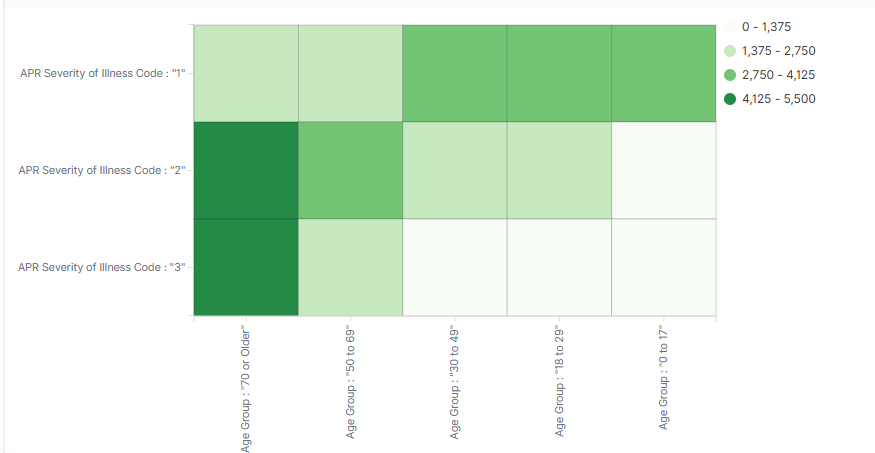
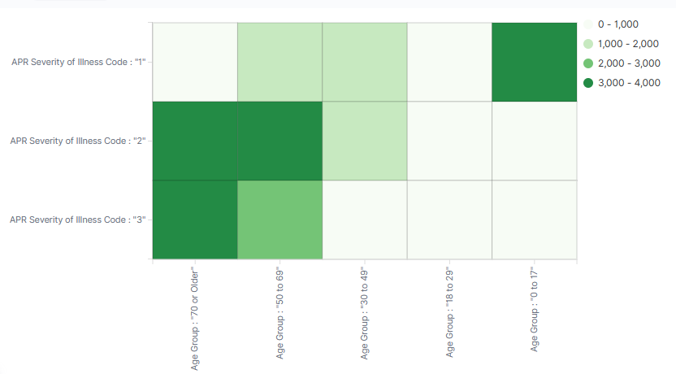

# 📊 Big Data in Clinical Decision Support System

## Overview
This project explores how **big data analytics** can enhance **Clinical Decision Support Systems (CDSS)**, enabling healthcare providers to deliver **personalized, evidence-based care**. By leveraging **electronic health records (EHRs)**, real-time data, and distributed processing frameworks, the study demonstrates how modern analytics can improve diagnostic efficiency, predict chronic diseases, and optimize treatment planning.

---

## Objectives
- Apply **visual analytics** and **MapReduce** to large-scale medical data.  
- Demonstrate feasibility of integrating big data into **healthcare decision-making**.  
- Analyze the relationship between **patient age, gender, and disease severity** using real datasets.  

---

## Methodology
- **Dataset**: New York State Hospital Inpatient Discharge data (Kaggle)  
- **Tools**:  
  - **Kibana/Elasticsearch** for visualization  
  - **MapReduce (Hadoop)** for distributed processing  
- **Process**:  
  1. Data cleaning and subsetting (Central NY region, 163,688 rows)  
  2. Visual analysis of **disease severity vs. age & gender**  
  3. Implementation of MapReduce pseudo-code for scalable real-time processing  

---

## Key Findings
- **Age & Disease Severity**:  
  - Female patients: disease severity increases significantly after 70 years old.  
  - Male patients: more concentrated distribution, but higher severity in older groups.  

- **Value of Big Data in Healthcare**:  
  - Enables **real-time insights** into patient health risks.  
  - Improves **accuracy** in predicting chronic disease development.  
  - Supports **personalized treatments** and **risk prevention**.  

---

## Visualizations
  
*Figure 1. Female patients show increased disease severity with age.*

  
*Figure 2. Male patients show concentrated severity distribution in older age groups.*

---

## Conclusion
Integrating **big data analytics** into CDSS offers significant potential:  
- Improves diagnostic efficiency and patient outcomes.  
- Provides **real-time monitoring** for chronic disease risks.  
- Enables healthcare professionals to make **faster, data-driven decisions**.  

⚠️ **Future Work**: Addressing **data privacy** and **security** challenges in healthcare analytics remains critical.  
