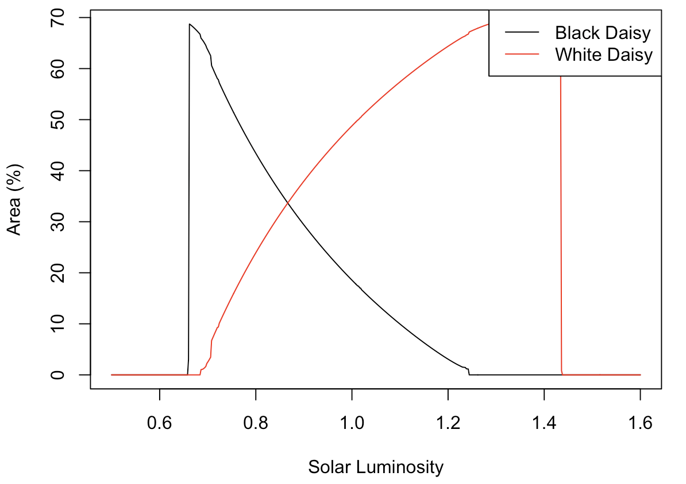
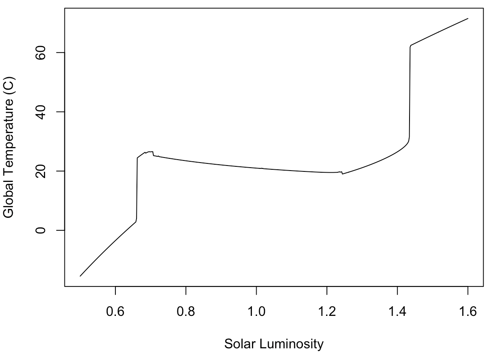

# 🌍 Modelling Daisyworld: An Exploration of Gaia Theory

## Overview
This project explores **Daisyworld**, a conceptual model proposed by James Lovelock and Andrew Watson (1983) to illustrate the **Gaia Hypothesis** — the idea that Earth functions as a self-regulating system. By simulating the interactions of black and white daisies with planetary temperature, the project demonstrates how simple feedback loops can regulate climate stability.

---

## Objectives
- Investigate **feedback mechanisms** in Daisyworld and their role in climate regulation.  
- Use **differential equations and simulations** to replicate Daisyworld dynamics.  
- Extend the model to include **greenhouse effects** and assess its implications for global warming.  

---

## Methodology
- **Approach**: Mathematical modelling + computer simulations.  
- **Equations**: System of differential equations describing daisy population growth, albedo changes, and planetary temperature.  
- **Simulation Process**:  
  1. Initialize daisy populations, albedo, and solar luminosity.  
  2. Iterate across luminosity levels, updating daisy growth and planetary temperature.  
  3. Record global temperature and population dynamics under varying conditions.  

---

## Key Findings
- **Self-regulation**:  
  - White daisies (high albedo) reflect sunlight and thrive in cooler conditions.  
  - Black daisies (low albedo) absorb heat and dominate in warmer conditions.  
  - Together, they maintain planetary temperature within a habitable range.  

- **Simulation Results**:  
  - As solar luminosity increases, black daisies decline while white daisies flourish.  
  - Planetary temperature stabilizes despite external forcing — evidence of feedback-driven homeostasis.  

- **Model Extension**: Adding greenhouse gas parameters highlights how climate feedbacks interact with external stressors.  

---

## Visualizations
  
*Figure 1. Black daisies decline while white daisies thrive as luminosity rises.*

  
*Figure 2. Planetary temperature stabilizes despite increasing luminosity, showing feedback regulation.*

---

## Applications
- **Global Warming Analogy**: Demonstrates how life-planet feedback loops can mitigate climate change.  
- **Education**: Provides an accessible tool for teaching feedback systems in ecology and climate science.  
- **Model Validation**: A starting point for developing more complex biosphere–climate interaction models.  

---

## Conclusion
The Daisyworld model illustrates how **life and environment co-evolve** through feedback mechanisms. While simplified, it highlights the principles of self-regulation, ecological resilience, and the Gaia Hypothesis. Extensions incorporating greenhouse gases and additional species broaden its relevance to **climate science, ecology, and education**.  

⚠️ **Limitations**: Daisyworld simplifies reality — it omits many species, feedbacks, and external influences. Its value lies more in **conceptual clarity** than in predictive accuracy.  
