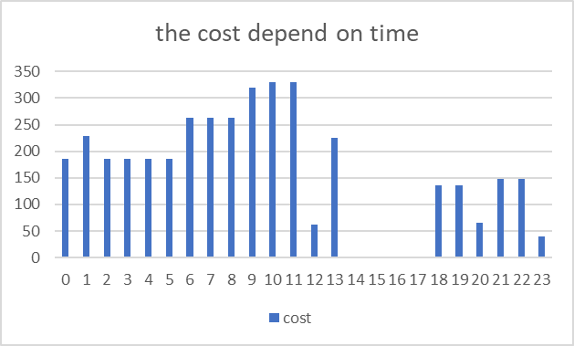
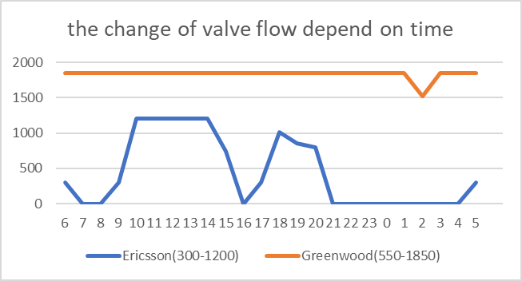

# 🌊 SUEZ Smart Solutions NZ — Smart Water Management

## Overview
This project investigates the application of **smart water solutions** in New Zealand, focusing on **IoT-enabled water metering**, **real-time data analytics**, and **predictive maintenance**.  
The aim is to enhance water efficiency, reduce losses, and improve sustainability in urban water networks.

---

## Objectives
- Assess the benefits of **smart metering and monitoring systems** for water utilities.  
- Demonstrate the use of **real-time analytics** for leak detection and demand forecasting.  
- Explore **predictive maintenance strategies** for optimizing infrastructure performance.  

---

## Methodology
- **Data Sources**: Water consumption data from pilot smart meters in NZ municipalities.  
- **Tools & Techniques**:  
  - IoT-enabled smart water meters for **high-frequency data collection**.  
  - Data analytics (Python, Power BI) for **pattern detection and anomaly recognition**.  
  - Comparative analysis of **traditional vs smart metering** approaches.  

---

## Key Findings
- **Improved Leak Detection**:  
  - Real-time monitoring reduced leak detection times from weeks to **hours**.  
  - Potential savings of up to **15–20% in annual water loss**.  

- **Demand Forecasting**:  
  - Smart data enabled better prediction of **peak usage periods**.  
  - Supported more efficient allocation of treatment and distribution resources.  

- **Sustainability Gains**:  
  - Significant reduction in **non-revenue water (NRW)**.  
  - Promoted sustainable water use aligned with New Zealand’s environmental goals.  

---

## Visualizations
  
*Figure 1. Example of hourly water demand patterns from IoT-enabled meters.*

  
*Figure 2. Smart dashboard highlighting abnormal usage and leak alerts.*

---

## Conclusion
The SUEZ Smart Solutions NZ case demonstrates how **IoT, data analytics, and predictive modelling** can transform water management:  

- Faster leak detection → reduced water losses.  
- Accurate demand forecasting → optimized resource allocation.  
- Enhanced sustainability → alignment with NZ water efficiency targets.  

📌 **Future Directions**:  
- Expand smart metering coverage across municipalities.  
- Integrate **AI-based predictive maintenance** to further enhance system resilience.  
- Explore public engagement tools to promote household-level water conservation.  
