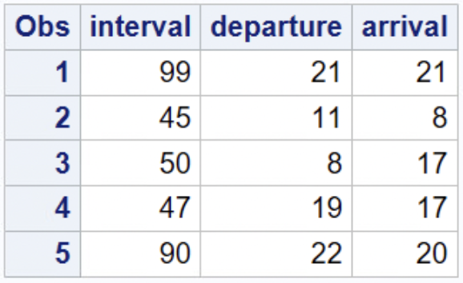
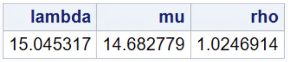
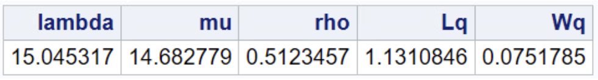

# 🚗 Traffic Congestion Analysis at SH1 Greenlane Interchange

## Overview
This project applies **queuing theory** to analyze congestion at the **Greenlane Interchange (SH1, Auckland)**.  
Using an **M/M/1 queuing model**, vehicle arrivals and departures were observed from ramp signal snapshots.  
The study evaluates traffic flow efficiency, identifies bottlenecks, and simulates improvements.

---

## Data Collection
- **Location**: SH1 Greenlane northbound ramp, Auckland.  
- **Observation**: Snapshots taken between **3:21–3:28 PM, May 14, 2024**.  
- **Approach**:  
  - Counted **arriving vs departing vehicles** in each screenshot.  
  - Calculated **average arrival rate (λ)** and **service rate (μ)**.  

  
*Figure 1. Sample snapshots showing vehicle arrivals and departures.*

---

## Queuing System
- **Model**: M/M/1 (single service channel, FIFO).  
- **Parameters**:  
  - Arrival rate (λ) – avg vehicles reaching ramp per hour.  
  - Service rate (μ) – avg vehicles passing green light per hour.  
  - Utilization (ρ = λ / μ).  
  - Avg queue length (Lq).  
  - Avg waiting time (Wq).  

### System Configuration
- Infinite population (vehicles continuously arrive).  
- Single queue (FIFO) with one traffic signal controlling entry.  
- Assumption: Vehicles obey red/green light sequence, no overtaking.

---

## Results
- **Observed Parameters** (from dataset):  
  - λ (arrival rate) = **15.045 vehicles/hour**  
  - μ (service rate) = **14.682 vehicles/hour**  
  - ρ (utilization) = **1.024** → system **overloaded**  

  
*Figure 2. Dataset from snapshot observations.*

  
*Figure 3. Queuing system parameters calculated in SAS.*

**Implication**:  
- Since λ > μ, the ramp system cannot reach steady-state.  
- This leads to **growing queues and long waiting times**.  
- Risk: queues spilling back into Greenlane East, worsening city congestion.

---

## Proposed Solution
- **Add one more lane** → converts system to **M/M/2 model**.  
- Benefits:  
  - Higher service rate (capacity doubled).  
  - Lower utilization (ρ < 1).  
  - Steady-state achieved → stable traffic flow.  

---

## Simulation of Solution
- With two lanes (M/M/2):  
  - Avg queue length (Lq) = **1.13 vehicles**  
  - Avg waiting time (Wq) = **0.075 hours ≈ 4.5 minutes**  
- Result: Queue stabilized at **1–2 vehicles**, waiting time ≤ 5 minutes.  

  
*Figure 4. Simulation showing improved queue length and waiting time after adding one lane.*

---

## Conclusion
- The SH1 Greenlane ramp currently operates **above capacity** (ρ > 1), causing severe congestion.  
- Applying queuing theory shows that **adding one lane** significantly improves performance.  
- **Policy implication**: Infrastructure upgrades like multi-lane ramps are a **cost-effective solution** to urban congestion.  

📌 **Future Work**: Extend model to include **peak vs off-peak demand**, multi-ramp interactions, and stochastic simulation of driver behaviors.
